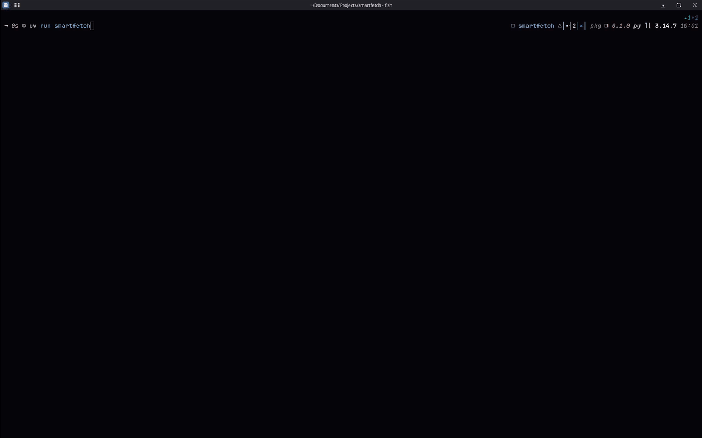

# SmartFetch

Fastfetch-style system stats with an LLM health diagnosis: the AI sidekick next to fastfetch, not a replacement.

Snapshot → query → staged panels: stats print instantly, the AI verdict lands when the model replies.

## Demo

Full run-through: default run (dual-GPU panels + AI verdict) → `--no-ai` stats only → `--json` raw dict.



## Quickstart

```bash
git clone <repo> && cd smartfetch
uv sync
ollama pull llama3.1:8b  # default model; -m NAME for others
ollama serve  # fetch spawns this itself if down
uv run smartfetch
```

## Usage

```bash
uv run smartfetch [--no-ai | --json | -m NAME | --keep]
```

| Flag | Description |
| ---- | ----------- |
| `--no-ai` | Show stats only. No model contacted. |
| `--json` | Print the raw stats dictionary. No panels, no AI. |
| `-m NAME`, `--model NAME` | Use this Ollama model (default: `llama3.1:8b`). |
| `--keep` | Leave the model loaded after the run. |

`--json` output (trimmed) — note the `GPUs` list alongside the first-card flat keys:

```json
{
  "OS": "CachyOS",
  "CPU": "12th Gen Intel(R) Core(TM) i9-12900H",
  "CPU%": 12.0,
  "GPU": "NVIDIA GeForce RTX 3070 Ti Laptop GPU",
  "VRAM Used": 0.11,
  "VRAM Total": 8.0,
  "GPUs": [
    {"GPU": "NVIDIA GeForce RTX 3070 Ti Laptop GPU", "VRAM Used": 0.11, "VRAM Total": 8.0},
    {"GPU": "Intel Corporation Alder Lake-P GT2 [Iris Xe Graphics] (rev 0c)", "VRAM Used": null, "VRAM Total": null}
  ]
}
```

## Requirements

- [Python 3.12+](https://www.python.org/) (PSF License)
- [uv](https://docs.astral.sh/uv/) (MIT)
- [Ollama](https://ollama.com/) with a pulled model (MIT)

## How it works

1. **Collect**: [psutil](https://github.com/giampaolo/psutil) (BSD-3), [platform](https://docs.python.org/3/library/platform.html) and [subprocess](https://docs.python.org/3/library/subprocess.html) (both PSF, stdlib) gather CPU, RAM, disk, GPU, and OS details into a single dictionary. Every value is real data or `None`; nothing ever raises.
2. **GPUs, all of them**: vendor ladder `nvidia-smi` → `rocm-smi` → `xpu-smi`, plus an `lspci` fallback that catches integrated GPUs (e.g. Intel Iris Xe, reported as `shared` VRAM since iGPUs use system RAM). Every card gets its own `GPU{i}` / `VRAM{i}` row; `GPUs` list in `--json` carries the full set while the flat `GPU` keys stay as first-card shorthand.
3. **Query**: the stats are sent to a local Ollama model via [requests](https://requests.readthedocs.io/) (Apache-2.0), which returns a five-sentence health verdict. CLI parsing is [argparse](https://docs.python.org/3/library/argparse.html) (PSF, stdlib).
4. **Render**: [rich](https://github.com/Textualize/rich) (MIT) panels display the ASCII logo, hardware stats, and AI diagnosis side by side.

## OS support

Linux-first. macOS and Windows boot degraded, never crash: unknown metrics become `None`, their panel rows hide, the AI verdict reasons over whatever is real.

## Project structure

```text
src/smartfetch/
├── __init__.py  # CLI entry point and pipeline conductor
├── collect.py   # hardware snapshot (smi ladder + lspci fallback)
├── ask.py       # Ollama client
├── view.py      # terminal UI (one row per GPU)
└── logo.py      # ASCII logos
```

## License

MIT, Sohan Gogula, 2026.
